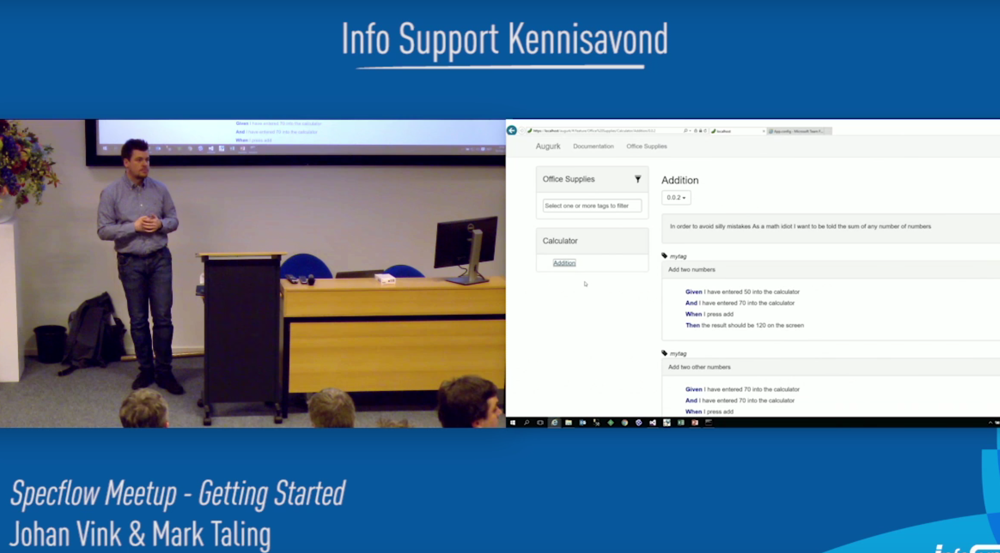
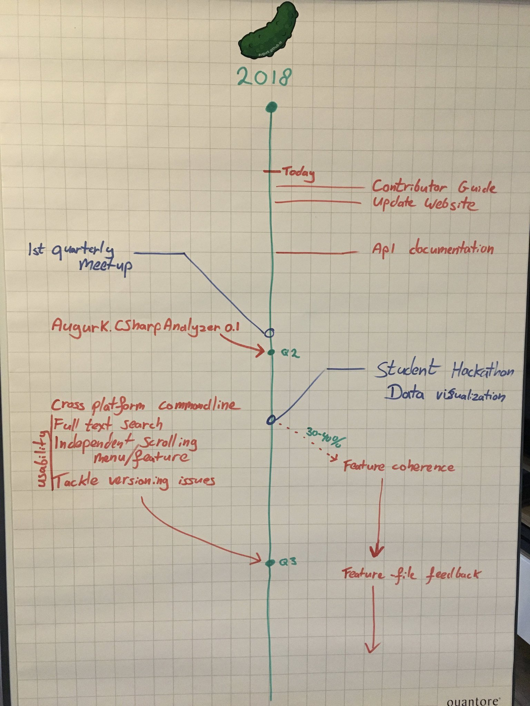

<!-- .slide: class="augurk" -->
## Timeline

  

    

      <h3>Mar-2014</h3>
      
First prototype @ R&amp;R WFM

    

  

  

    

      <h3>May-2014</h3>
      
Open source on GitHub

    

  

  

    

      <h3>Jan-2015</h3>
      
Switch to open source db

    

  

  
 
    

      <h3>Apr-2015</h3>
      
1.0.0 releases

    

  
  

 

---
<!-- .slide: class="augurk" -->
 

  

    

      <h3>Jul-2015</h3>
      
Jonathan joins

    

  

  

    

      <h3>Sep-2015</h3>
      
2.0.0 release with versioning

    

  

  

    

      <h3>Dec-2015</h3>
      
Command line tool released

    

  

  

  
---
<!-- .slide: class="augurk" -->
 

  

    

      <h3>Feb-2016</h3>
      
First Dutch SpecFlow Users Meetup

      
    

  

  

    

      <h3>Apr-2017</h3>
      
New Feature: Product descriptions

    

  

  

    

      <h3>Sep-2017</h3>
      
New Feature: Retention Policy

    

  
  

 

---
<!-- .slide: class="augurk" -->
